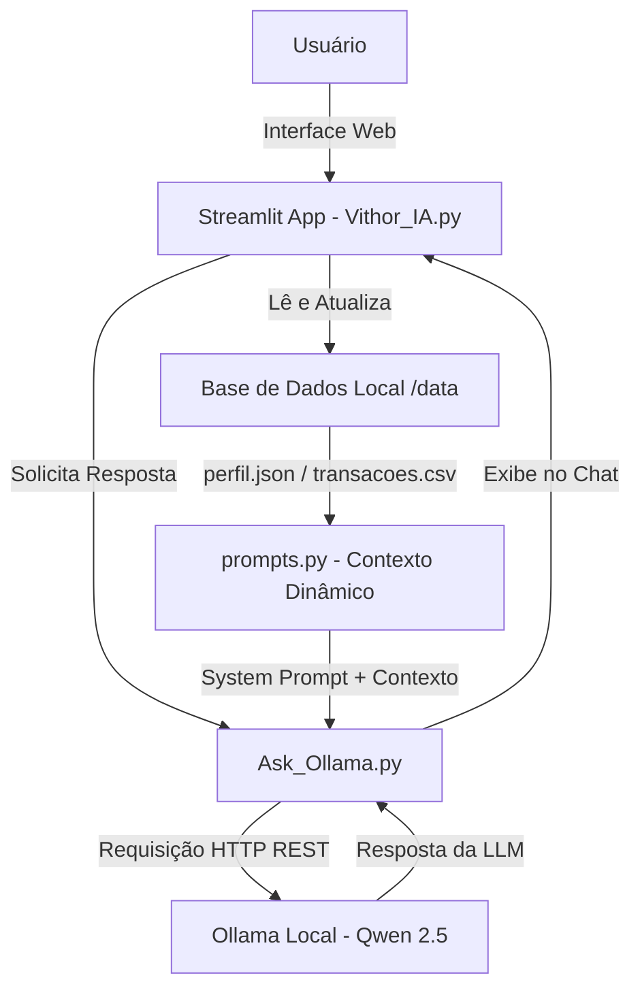

# 🤖 VithorIA - Sua Assistente em AI Financeira

> **Assistente financeira pessoal, local e proativa para organização de gastos, planejamento de orçamento e conquista de metas.**

A **VithorIA** é uma agente financeira inteligente que atua de forma consultiva para auxiliar usuários na organização de orçamentos, categorização de despesas e planejamento de metas. Ela foi projetada para rodar **100% localmente**, garantindo privacidade absoluta dos dados financeiros e custos zero de infraestrutura por meio do **Ollama**.

---

## 🎯 Caso de Uso e Funcionalidades

A **VithorIA** resolve a dificuldade de organização orçamentária e a falta de clareza no atingimento de metas financeiras.

- **📊 Análise Dinâmica de Transações:** Leitura e edição em tempo real do histórico de despesas e receitas.
- **📈 Gráficos e Fluxo de Caixa:** Exibição visual da evolução temporal de Entradas x Saídas via gráficos interativos.
- **⚙️ Configuração de Perfil & Metas:** Interface via `st.popover` para edição de nome, renda e metas sem perder o contexto do chat.
- **🎯 Planejamento Consultivo de Metas:** Avaliação de viabilidade e sugestão de cortes de gastos não essenciais (lazer, compras) preservando despesas essenciais.
- **🔒 Segurança & Anti-Alucinação:** Respostas estritamente baseadas na base de conhecimento local do cliente (`JSON` e `CSV`).

---

## 🧠 Arquitetura do Sistema



---

## 📁 Estrutura do Repositório

```text
📁 VithorIA/
│
├── 📁 app/                           # Código-fonte da aplicação
│   ├── Vithor_IA.py                 # Interface Streamlit (Chatbot, Dashboard e Sidebar)
│   ├── Ask_Ollama.py                # Cliente de integração com a API local do Ollama
│   ├── prompts.py                   # System Prompt e construtor de contexto dinâmico
│   └── executavel.ps1               # Executável de automação para Windows
│
├── 📁 assets/                        # Recursos estáticos do repositório
│
├── 📁 data/                          # Dados mockados do cliente para o agente
│   ├── historico_atendimento.csv     # Histórico de atendimentos (CSV)
│   ├── perfil_investidor.json        # Perfil do cliente (JSON)
│   ├── produtos_financeiros.json     # Produtos disponíveis (JSON)
│   └── transacoes.csv                # Histórico de transações (CSV)
│
├── 📁 docs/                          # Documentação técnica do projeto
│   ├── 01-documentacao-agente.md     # Caso de uso e arquitetura
│   ├── 02-base-conhecimento.md       # Estratégia de dados
│   ├── 03-prompts.md                 # Engenharia de prompts
│   ├── 04-metricas.md                # Avaliação e métricas
│   └── 05-pitch.md                   # Roteiro do pitch
│
├── 📁 examples/                      # Exemplos e referências adicionais
│   └── README.md
│
├── 📁 Images/                        # Imagens e ícones de customização do app
└── 📄 README.md                      # Documentação principal
```

---

## 🚀 Como Executar o Projeto

Você pode rodar a **VithorIA** em máquinas Windows ou Linux. O projeto utiliza o modelo `qwen2.5:7b` via Ollama.

### 🪟 No Windows (PowerShell)

1. **Inicie o Ollama em segundo plano:**
   ```bash
   ollama serve
   ```

2. **Garantir que o modelo Qwen 2.5 está baixado:**
   ```bash
   ollama pull qwen2.5:7b
   ```

3. **Execute a aplicação Streamlit via PowerShell:**
   ```powershell
   .\app\executavel.ps1
   ```

---

## 🛠️ Tecnologias Utilizadas

- **Linguagem:** Python 3.10+
- **Interface Gráfica:** Streamlit
- **Processamento de Dados:** Pandas
- **LLM Local & Runtime:** Ollama / Qwen 2.5 7B ou gpt-oss
- **Automação:** PowerShell Script (`.ps1`) e Bash Shell Script (`.sh`)

---

## 📊 Avaliação e Segurança (Anti-Alucinação)

A **VithorIA** adota regras estritas em seu System Prompt para atuar com total segurança:

1. **Veracidade Estrita:** Utiliza exclusivamente as informações presentes no `perfil_investidor.json` e `transacoes.csv`.
2. **Reconhecimento de Limitações:** Admite quando não possui dados suficientes sobre uma pergunta sem inventar métricas.
3. **Respeito à Decisão do Usuário:** Sugere otimizações orçamentárias, mas alerta sobre consequências sem impor decisões coercitivas.

---

## 🎬 Pitch e Demonstração

- **Vídeo do Pitch (3 minutos):** [Assista ao Vídeo no YouTube](https://youtu.be/aeTvjMDC62s?si=hiE337gKmp7rtJOY)
- **Documentação Técnica Completa:** Disponível na pasta [`docs/`](https://github.com/Dandan-Dev-Py/dio-lab-bia-do-futuro/tree/main/docs)
